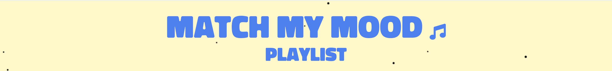

# Match My Mood Playlist 

Match My Mood Playlist is a web app that generates personalized YouTube playlists based on your current mood.

## Features 
- Personalized playlist generation based on mood.
- Videos fetched using the YouTube API via an AWS Lambda function.
- Seamless video playback in a new tab.
- Real-time fetching and display of playlist data.
  
## Technologies Used 
- **Frontend:** HTML, CSS, JavaScript (ES6+)
- **Backend:** AWS Lambda (Node.js)
- **API:** YouTube Data API v3
- **Deployment:** AWS API Gateway, Lambda
- **Authentication:** API keys stored securely in Lambda environment variables

## How It Works 
1. **User Input:** Users select their mood from predefined options (e.g., hype, chill, sad).
2. **Fetching Playlist:** The frontend makes a request to the AWS Lambda function and passes the mood as a query parameter.
3. **YouTube API Interaction:** Lambda function processes the request, calls the YouTube API, and filters videos based on the mood.
4. **Displaying Videos:** A playlist recommendation is returned and displayed to the user. Each playlist link opens in a new tab and auto-plays for an engaging user experience.

## Challenges Faced 

### Embedding YouTube Videos
I initially attempted to embed YouTube videos directly into the web app. However, I encountered a limitation with the YouTube API: **embedding was not allowed** in the context of this app. This constraint forced me to rethink the user interaction design. Instead of embedding videos, I decided to open the videos in a **new tab** with **auto-play** enabled. This change was essential for improving the user experience, as it allowed users to immediately enjoy the playlist without waiting for the video to load. 

### AWS Lambda Function Setup

Setting up the AWS Lambda function initially presented a challenge. After deploying the function, I noticed that despite the API key being correctly configured in the Lambda environment variables, the request to the YouTube API wasn’t retrieving any data. Chrome Developer Tools showed that the request was made, but the response was empty, which led to the conclusion that something was wrong with how the API was being called.

Upon further investigation, I realized that the **Lambda function URL** wasn’t properly set up to communicate with the YouTube API. After running tests and adjusting the Lambda function’s configuration, I was able to fix the URL and ensure that the YouTube API returned the expected data.


## Getting Started 

To run the project locally, follow these steps:

1. Clone the repository:

   ```bash
   git clone https://github.com/yourusername/mood-playlist.git
   cd match-my-mood-playlist
